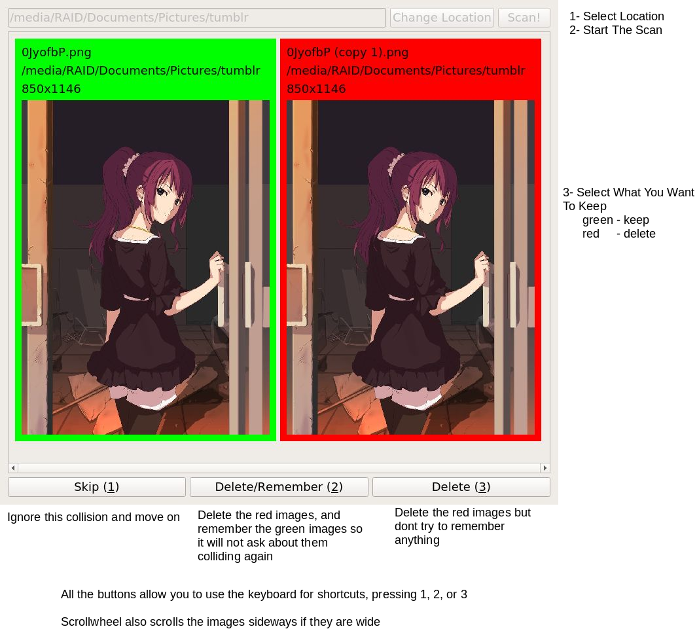

# Duplicate Image Finder

Simply parses a given folder location and finds images that are likely duplicates. When it finds some images that might be duplicates, it askes the user what they want to do.

I have been using this program for awhile, and it is very useful for every time I download an album from imgur.

Get the latest [release here](https://github.com/glop102/DuplicateImageFinder/releases/latest)

## How To Use



## How To Compile

```
mkdir build
cd build
qmake ..
make
```
